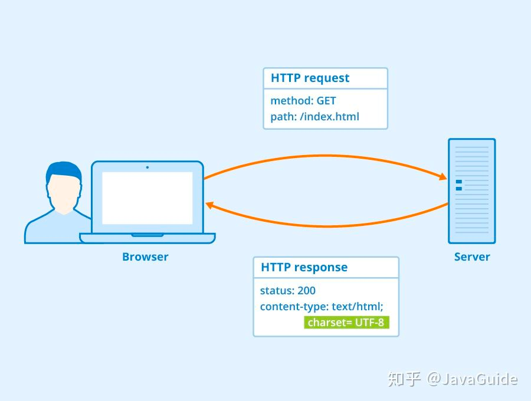
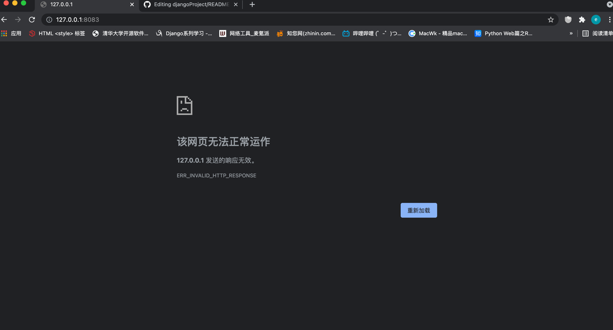
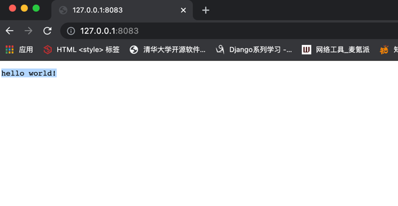
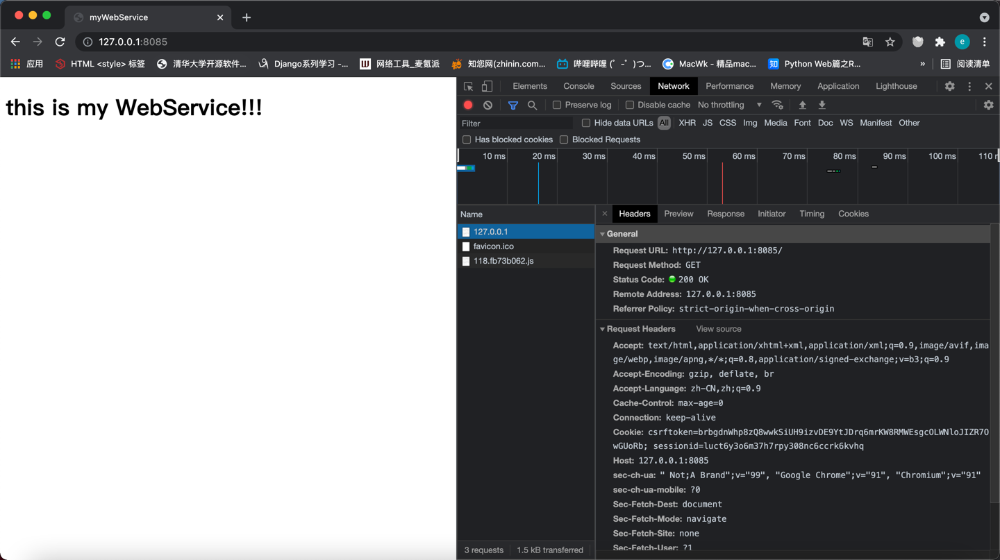
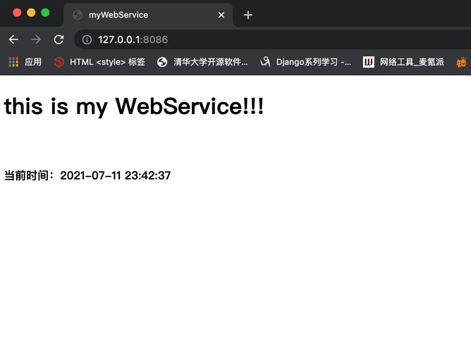
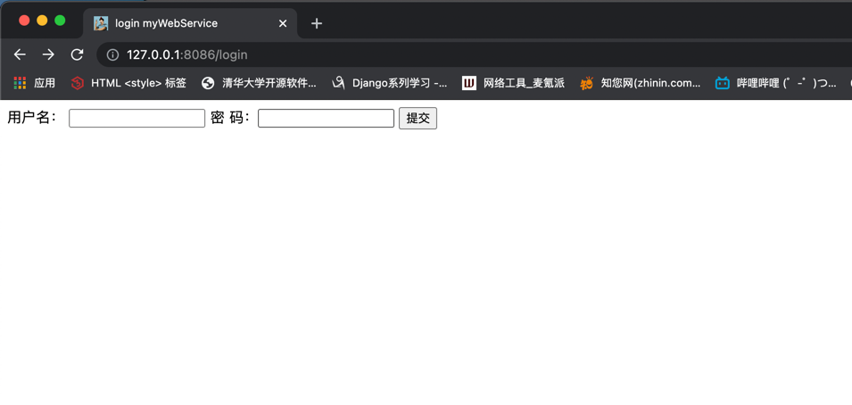
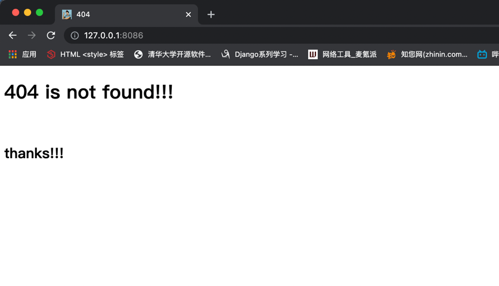

# DiyWebService
### 手写一个web服务器

###### 实现 HTTP Server 必知的前置知识既然，我们要实现 HTTP Server 那必然先要回顾一下 HTTP 协议相关的基础知识。HTTP 协议超文本传输协议（HTTP，HyperText Transfer Protocol)主要是为 Web 浏览器与 Web 服务器之间的通信而设计的。当我们使用浏览器浏览网页的时候，我们网页就是通过 HTTP 请求进行加载的，整个过程如下图所示。



### 创建一个socket对象

```python
server = socket.socket()

server.bind(('127.0.0.1',8083))
server.listen(5)
while True:
    # 获取conn，addr
    conn, addr = server.accept()
    # 获取浏览器传来的数据
    data = conn.recv(1024)
    print(data)
    conn.send(b'hello world!')
    conn.close()

```
返回结果



因为返回给浏览器数据(不符合http协议)，所以浏览器响应失败

### 返回符合html格式的数据

```python
server = socket.socket()

server.bind(('127.0.0.1',8083))
server.listen(5)
while True:
    # 获取conn，addr
    conn, addr = server.accept()
    # 获取浏览器传来的数据
    data = conn.recv(1024)
    print(data)
    conn.send(b'HTTP/1.1\r\n ok \r\n 200 \r\n\r\nhello world!')
    conn.close()

```

### 返回响应结果




### 返回html文件
```python
server = socket.socket()
addr = '127.0.0.1'
port = 8081
server.bind((addr,port))
server.listen(5)
print('web服务器启动成功！%s:%s'%(addr,port))
while True:
    # 获取conn，addr
    conn, addr = server.accept()
    # 获取浏览器传来的数据
    data = conn.recv(1024)
    # 读取html
    with open('html/index.html','r') as f:
        data = f.read()
    res = 'HTTP/1.1\r\n ok \r\n 200 \r\n\r\n %s'%data
    conn.send(res.encode('utf-8'))
    # 关闭conn
    conn.close()

```
通过浏览器向服务器发起请求访，服务器响应一个html页面



### 通过replace给静态html传入参数
```python
server = socket.socket()
addr = '127.0.0.1'
port = 8086
server.bind((addr,port))
server.listen(5)
print('web服务器启动成功！%s:%s'%(addr,port))
while True:
    # 获取conn，addr
    conn, addr = server.accept()
    # 获取浏览器传来的数据
    data = conn.recv(1024)
    time = datetime.now().strftime('%Y-%m-%d %H:%M:%S')
    with open('html/index.html','r') as f:
        data = f.read().replace('{{time}}',str(time))

    response = 'HTTP/1.1 200 ok \r\n\r\n %s' % data
    conn.send(response.encode('utf-8'))
    conn.close()

```
### 动态传入时间参数



### 通过wsgi接口实现更加完整的web服务

###### wsgi_service.py
```python
def application(environ,start_response):
    # 获取请求path
    pathinfo = environ.get('PATH_INFO')
    # 返回响应头设置
    start_response("200 OK", [('Content-Type', 'text/html; charset=utf-8')])

    func = None
    for item in url_patterns:
        if pathinfo == item[0]:
            func = item[1]
            break

    if func:
        return [func(environ)]
    else:
        print('this is 404 not found!!')
        return [read_data('html/404notFound.html')]

addr = '127.0.0.1'
port = 8086
httped = make_server(addr,port,application)
print('web服务器启动成功！%s:%s'%(addr,port))
# 开始监听http请求
httped.serve_forever()
```

###### urls.py
```python
from views import *

url_patterns=[
        ('/login',login),
        ('/index',index),
        ('/favicon.ico',favicon)
    ]
```

###### views.py
```python
from utils.read_data_utils import *

def login(environ):
    return read_data('html/login.html')

def index(environ):
    print(environ)
def favicon(environ):
    return read_data('images/favicon.ico')

```

###### utils.py
```python
def read_data(path):
    with open(path,'rb') as f:
       data = f.read()
    return data
```

### 浏览器向服务器发送请求对象，wsgi进行了封装
``` text
{'PATH': '/Users/endless/.local/share/virtualenvs/DiyWebService-Hu0I6zVr/bin:/Library/Frameworks/Python.framework/Versions/3.8/bin:/opt/homebrew/bin:/opt/homebrew/sbin:/opt/homebrew/bin:/opt/homebrew/sbin:/usr/local/bin:/usr/bin:/bin:/usr/sbin:/sbin:/opt/homebrew/anaconda3/bin', 'MANPATH': '/opt/homebrew/share/man:/opt/homebrew/share/man:::', 'HOMEBREW_PREFIX': '/opt/homebrew', 'COMMAND_MODE': 'unix2003', 'PS1': '(DiyWebService) ', 'VERSIONER_PYTHON_VERSION': '2.7', 'LOGNAME': 'endless', 'HOMEBREW_REPOSITORY': '/opt/homebrew', 'XPC_SERVICE_NAME': 'application.com.jetbrains.pycharm.934647.935515', 'PWD': '/Users/endless/PycharmProjects/DiyWebService', 'PYCHARM_HOSTED': '1', 'INFOPATH': '/opt/homebrew/share/info:/opt/homebrew/share/info:', 'PYCHARM_DISPLAY_PORT': '63342', '__CFBundleIdentifier': 'com.jetbrains.pycharm', 'PYTHONPATH': '/Users/endless/PycharmProjects/DiyWebService:/Applications/PyCharm.app/Contents/plugins/python/helpers/pycharm_matplotlib_backend:/Applications/PyCharm.app/Contents/plugins/python/helpers/pycharm_display', 'SHELL': '/bin/zsh', 'PYTHONIOENCODING': 'UTF-8', 'HOMEBREW_BOTTLE_DOMAIN': 'https://mirrors.ustc.edu.cn/homebrew-bottles/bottles', 'HOMEBREW_CELLAR': '/opt/homebrew/Cellar', 'OLDPWD': '/', 'USER': 'endless', 'TMPDIR': '/var/folders/bv/5_j5gqkn59l9rr9vdbwx0n980000gn/T/', 'SSH_AUTH_SOCK': '/private/tmp/com.apple.launchd.c0ShkjTtMr/Listeners', 'VIRTUAL_ENV': '/Users/endless/.local/share/virtualenvs/DiyWebService-Hu0I6zVr', 'XPC_FLAGS': '0x0', 'PYTHONUNBUFFERED': '1', '__CF_USER_TEXT_ENCODING': '0x1F5:0x19:0x34', 'LC_CTYPE': 'zh_CN.UTF-8', 'HOME': '/Users/endless', 'SERVER_NAME': '1.0.0.127.in-addr.arpa', 'GATEWAY_INTERFACE': 'CGI/1.1', 'SERVER_PORT': '8086', 'REMOTE_HOST': '', 'CONTENT_LENGTH': '25', 'SCRIPT_NAME': '', 'SERVER_PROTOCOL': 'HTTP/1.1', 'SERVER_SOFTWARE': 'WSGIServer/0.2', 'REQUEST_METHOD': 'POST', 'PATH_INFO': '/login/', 'QUERY_STRING': '', 'REMOTE_ADDR': '127.0.0.1', 'CONTENT_TYPE': 'application/x-www-form-urlencoded', 'HTTP_HOST': '127.0.0.1:8086', 'HTTP_CONNECTION': 'keep-alive', 'HTTP_CACHE_CONTROL': 'max-age=0', 'HTTP_SEC_CH_UA': '" Not;A Brand";v="99", "Google Chrome";v="91", "Chromium";v="91"', 'HTTP_SEC_CH_UA_MOBILE': '?0', 'HTTP_UPGRADE_INSECURE_REQUESTS': '1', 'HTTP_ORIGIN': 'http://127.0.0.1:8086', 'HTTP_USER_AGENT': 'Mozilla/5.0 (Macintosh; Intel Mac OS X 10_15_7) AppleWebKit/537.36 (KHTML, like Gecko) Chrome/91.0.4472.114 Safari/537.36', 'HTTP_ACCEPT': 'text/html,application/xhtml+xml,application/xml;q=0.9,image/avif,image/webp,image/apng,*/*;q=0.8,application/signed-exchange;v=b3;q=0.9', 'HTTP_SEC_FETCH_SITE': 'same-origin', 'HTTP_SEC_FETCH_MODE': 'navigate', 'HTTP_SEC_FETCH_USER': '?1', 'HTTP_SEC_FETCH_DEST': 'document', 'HTTP_REFERER': 'http://127.0.0.1:8086/login', 'HTTP_ACCEPT_ENCODING': 'gzip, deflate, br', 'HTTP_ACCEPT_LANGUAGE': 'zh-CN,zh;q=0.9', 'HTTP_COOKIE': 'csrftoken=brbgdnWhp8zQ8wwkSiUH9izvDE9YtJDrq6mrKW8RMWEsgcOLWNloJIZR7OwGUoRb; sessionid=luct6y3o6m37h7rpy308nc6ccrk6kvhq', 'wsgi.input': <_io.BufferedReader name=5>, 'wsgi.errors': <_io.TextIOWrapper name='<stderr>' mode='w' encoding='utf-8'>, 'wsgi.version': (1, 0), 'wsgi.run_once': False, 'wsgi.url_scheme': 'http', 'wsgi.multithread': False, 'wsgi.multiprocess': False, 'wsgi.file_wrapper': <class 'wsgiref.util.FileWrapper'>}
```

### 客户端向服务器发送/login请求，服务器响应login.html页面



### 当服务器找不到该资源，将返回404页面



### 登录页面验证（POST）

### 数据库操作


